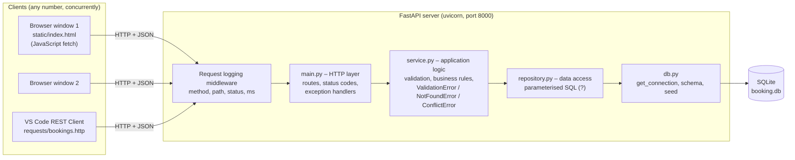
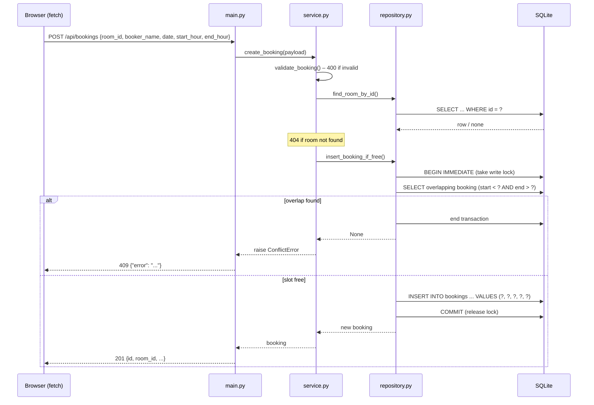
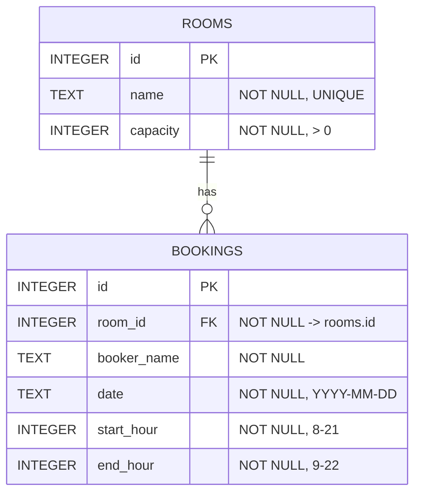

# Evidence – Room Booking API

Supporting evidence for the COMP713 Assessment 2 report (Option A).
Generated on 2026-09-23 on Windows 11, Python 3.14.0.

## 1. Automated test results (pytest)

Command (run from the project folder with the virtual environment active):

```
pytest -v
```

Full output:

```
============================= test session starts =============================
platform win32 -- Python 3.14.0, pytest-9.1.1, pluggy-1.6.0 -- D:\CIS\Year 3\SEM2\COMP713 - DMS\Assignment\RoomBooking\.venv\Scripts\python.exe
rootdir: D:\CIS\Year 3\SEM2\COMP713 - DMS\Assignment\RoomBooking
configfile: pytest.ini
testpaths: tests
plugins: anyio-4.15.1
collecting ... collected 38 items

tests/test_api.py::test_list_rooms_returns_200_and_seeded_rooms PASSED   [  2%]
tests/test_api.py::test_create_booking_returns_201_with_booking PASSED   [  5%]
tests/test_api.py::test_booker_name_is_trimmed_and_50_chars_allowed PASSED [  7%]
tests/test_api.py::test_invalid_booking_returns_400[changes0] PASSED     [ 10%]
tests/test_api.py::test_invalid_booking_returns_400[changes1] PASSED     [ 13%]
tests/test_api.py::test_invalid_booking_returns_400[changes2] PASSED     [ 15%]
tests/test_api.py::test_invalid_booking_returns_400[changes3] PASSED     [ 18%]
tests/test_api.py::test_invalid_booking_returns_400[changes4] PASSED     [ 21%]
tests/test_api.py::test_invalid_booking_returns_400[changes5] PASSED     [ 23%]
tests/test_api.py::test_invalid_booking_returns_400[changes6] PASSED     [ 26%]
tests/test_api.py::test_invalid_booking_returns_400[changes7] PASSED     [ 28%]
tests/test_api.py::test_invalid_booking_returns_400[changes8] PASSED     [ 31%]
tests/test_api.py::test_invalid_booking_returns_400[changes9] PASSED     [ 34%]
tests/test_api.py::test_invalid_booking_returns_400[changes10] PASSED    [ 36%]
tests/test_api.py::test_invalid_booking_returns_400[changes11] PASSED    [ 39%]
tests/test_api.py::test_invalid_booking_returns_400[changes12] PASSED    [ 42%]
tests/test_api.py::test_missing_body_field_returns_400 PASSED            [ 44%]
tests/test_api.py::test_malformed_json_returns_400 PASSED                [ 47%]
tests/test_api.py::test_create_booking_for_unknown_room_returns_404 PASSED [ 50%]
tests/test_api.py::test_overlapping_booking_returns_409[10-12] PASSED    [ 52%]
tests/test_api.py::test_overlapping_booking_returns_409[11-13] PASSED    [ 55%]
tests/test_api.py::test_overlapping_booking_returns_409[9-11] PASSED     [ 57%]
tests/test_api.py::test_overlapping_booking_returns_409[9-13] PASSED     [ 60%]
tests/test_api.py::test_overlapping_booking_returns_409[10-11] PASSED    [ 63%]
tests/test_api.py::test_adjacent_bookings_are_allowed PASSED             [ 65%]
tests/test_api.py::test_same_time_in_different_room_is_allowed PASSED    [ 68%]
tests/test_api.py::test_concurrent_requests_cannot_double_book PASSED    [ 71%]
tests/test_api.py::test_list_bookings_for_room_and_date PASSED           [ 73%]
tests/test_api.py::test_list_bookings_unknown_room_returns_404 PASSED    [ 76%]
tests/test_api.py::test_list_bookings_invalid_date_returns_400[?date=not-a-date] PASSED [ 78%]
tests/test_api.py::test_list_bookings_invalid_date_returns_400[?date=2030-13-01] PASSED [ 81%]
tests/test_api.py::test_list_bookings_invalid_date_returns_400[] PASSED  [ 84%]
tests/test_api.py::test_delete_booking_returns_204 PASSED                [ 86%]
tests/test_api.py::test_delete_unknown_booking_returns_404 PASSED        [ 89%]
tests/test_api.py::test_delete_then_rebook_same_slot_succeeds PASSED     [ 92%]
tests/test_api.py::test_database_unavailable_returns_503 PASSED          [ 94%]
tests/test_api.py::test_unknown_route_uses_json_error_shape PASSED       [ 97%]
tests/test_api.py::test_client_page_is_served_at_root PASSED             [100%]

============================= 38 passed in 1.71s ==============================
```

Meaning of the parameterised 400 cases (`test_invalid_booking_returns_400`),
in the order they appear in `tests/test_api.py`:

| Case | Input that is changed from a valid booking |
|------|--------------------------------------------|
| changes0 | `booker_name` = `""` (blank) |
| changes1 | `booker_name` = `"   "` (whitespace only) |
| changes2 | `booker_name` missing (`null`) |
| changes3 | `booker_name` 51 characters (too long) |
| changes4 | `date` = `"25-12-2030"` (wrong format) |
| changes5 | `date` = `"2030-02-30"` (impossible date) |
| changes6 | `date` = yesterday (in the past) |
| changes7 | 7–9 (starts before 08:00) |
| changes8 | 21–23 (ends after 22:00) |
| changes9 | 12–12 (end equals start) |
| changes10 | 14–12 (end before start) |
| changes11 | `start_hour` = 10.5 (not a whole number) |
| changes12 | `room_id` = `"one"` (not a number) |

Each test runs against its own temporary SQLite file (pytest `tmp_path`), so
tests are independent and never touch the real `booking.db`.

## 2. Architecture and communication flow



Error flow: `service.py` raises a custom exception → a handler in `main.py`
converts it to `400` / `404` / `409` with body `{"error": "..."}`. Any
`sqlite3.Error` raised in `repository.py`/`db.py` is converted to
`503 {"error": "Database unavailable, please try again later"}`; the real
error is printed only in the server console.

Sequence for creating a booking, including the concurrency control:



## 3. Data model (ER description)



- **rooms** – one row per bookable room. `id` is the primary key, `name` is
  unique, `capacity` must be greater than 0. Seeded with Study Room A (4),
  Study Room B (6) and Seminar Room (20).
- **bookings** – one row per booking. `room_id` is a foreign key to
  `rooms.id` (`ON DELETE CASCADE`; foreign keys are switched on for every
  connection with `PRAGMA foreign_keys = ON`).
- **Relationship:** one room has zero or more bookings; each booking belongs
  to exactly one room (1 : N).
- **CHECK constraints** in the schema: `start_hour BETWEEN 8 AND 21`,
  `end_hour BETWEEN 9 AND 22`, `end_hour > start_hour`. These are a safety net
  behind the validation in `service.py`.
- **Overlap rule** (enforced in the application, inside a transaction): two
  bookings of the same room on the same date overlap when
  `new.start < existing.end AND new.end > existing.start`.

## 4. Endpoints and status codes

| Method | Path | Status codes | Covered by automated tests |
|--------|------|--------------|----------------------------|
| GET | `/api/rooms` | 200, 503 | `test_list_rooms_returns_200_and_seeded_rooms`, `test_database_unavailable_returns_503` |
| GET | `/api/rooms/{room_id}/bookings?date=YYYY-MM-DD` | 200, 400, 404, 503 | `test_list_bookings_for_room_and_date`, `test_list_bookings_invalid_date_returns_400` (3 cases), `test_list_bookings_unknown_room_returns_404` |
| POST | `/api/bookings` | 201, 400, 404, 409, 503 | `test_create_booking_returns_201_with_booking`, `test_invalid_booking_returns_400` (13 cases), `test_missing_body_field_returns_400`, `test_malformed_json_returns_400`, `test_create_booking_for_unknown_room_returns_404`, `test_overlapping_booking_returns_409` (5 cases), `test_adjacent_bookings_are_allowed`, `test_concurrent_requests_cannot_double_book` |
| DELETE | `/api/bookings/{booking_id}` | 204, 400, 404, 503 | `test_delete_booking_returns_204`, `test_delete_unknown_booking_returns_404`, `test_delete_then_rebook_same_slot_succeeds` |
| GET | `/` (web client) | 200 | `test_client_page_is_served_at_root` |
| any | unknown path | 404 | `test_unknown_route_uses_json_error_shape` |

Notes on coverage:

- 503 is tested automatically only on `GET /api/rooms`. The other endpoints use
  the same global `sqlite3.Error` handler.
- It was also checked manually by starting the real server with
  `BOOKING_DB_PATH` pointing to a non-existent folder: `GET /api/rooms`
  returned 503 with the generic message.
- 400 for a non-numeric id in the URL was checked manually for
  `GET /api/rooms/abc/bookings`. It is not covered by an automated test.
  The same FastAPI mechanism applies to `DELETE /api/bookings/{id}`, but that
  was not checked separately.
- 405 (wrong method) was checked manually and returns `{"error": "Method Not Allowed"}`.

## 5. Function-by-function status

Labels used: **Completed and tested**, **Completed but only partially
tested**, **Partially completed**, **Not completed**.

### Server – `db.py`

| Function | Status | Evidence |
|----------|--------|----------|
| `get_connection()` | Completed and tested | Used by every automated test. The failure path is tested by `test_database_unavailable_returns_503`. |
| `init_db()` | Completed and tested | Runs at the start of every test (lifespan). The seeded rooms are checked by `test_list_rooms_returns_200_and_seeded_rooms`. |

### Server – `repository.py`

| Function | Status | Evidence |
|----------|--------|----------|
| `find_all_rooms()` | Completed and tested | `test_list_rooms_returns_200_and_seeded_rooms` |
| `find_room_by_id()` | Completed and tested | The 404 unknown-room tests, plus all successful create/list tests |
| `find_bookings()` | Completed and tested | `test_list_bookings_for_room_and_date` (filters by room and date, sorted) |
| `insert_booking_if_free()` | Completed and tested | 201, 409, adjacent-booking and different-room tests; `test_concurrent_requests_cannot_double_book` (20 parallel threads, exactly 1 succeeds) |
| `delete_booking()` | Completed and tested | `test_delete_booking_returns_204`, `test_delete_unknown_booking_returns_404`, `test_delete_then_rebook_same_slot_succeeds` |

### Server – `service.py`

| Function | Status | Evidence |
|----------|--------|----------|
| `parse_date()` | Completed and tested | Invalid-format, impossible-date and missing-date cases for both POST and GET |
| `_require_int()` | Completed and tested | Non-integer hour, non-numeric `room_id` and missing `end_hour` cases |
| `validate_booking()` | Completed and tested | 13 parameterised 400 cases, the trimming / 50-character boundary test, and the missing-field test |
| `list_rooms()` | Completed and tested | `test_list_rooms_returns_200_and_seeded_rooms` |
| `_require_room()` | Completed and tested | 404 tests for GET bookings and POST |
| `get_bookings()` | Completed and tested | GET bookings tests (200 / 400 / 404) |
| `create_booking()` | Completed and tested | POST tests (201 / 400 / 404 / 409) and the concurrency test |
| `cancel_booking()` | Completed and tested | DELETE tests (204 / 404) |

### Server – `main.py`

| Function | Status | Evidence |
|----------|--------|----------|
| `lifespan()` | Completed and tested | Normal startup runs in every test. The "database cannot be initialised" path was checked manually only: the server started with `BOOKING_DB_PATH` in a missing folder, logged the error, and answered 503. |
| `log_requests()` (middleware) | Completed and tested | Manual check only: the server console showed lines such as `[http] POST /api/bookings -> 201 (15.7 ms)` and `[http] POST /api/bookings -> 409 (9.0 ms)`. No automated test asserts on the log output. |
| `error_response()` | Completed and tested | Used by every error test |
| `handle_validation_error()` (400) | Completed and tested | 400 tests |
| `handle_not_found()` (404) | Completed and tested | 404 tests |
| `handle_conflict()` (409) | Completed and tested | 409 tests |
| `handle_database_error()` (503) | Completed and tested | `test_database_unavailable_returns_503`, plus the manual check with a missing database folder |
| `handle_bad_request()` (framework validation → 400) | Completed and tested | `test_malformed_json_returns_400`. A non-numeric path id was checked manually. |
| `handle_http_error()` (404/405) | Completed but only partially tested | 404 is tested by `test_unknown_route_uses_json_error_shape`. 405 was checked manually once. |
| `handle_unexpected_error()` (500) | Completed but only partially tested | Implemented, but no test or manual check has triggered it. |
| `list_rooms`, `list_bookings`, `create_booking`, `cancel_booking` routes | Completed and tested | Endpoint tests in section 4 |
| Static file mount at `/` | Completed and tested | `test_client_page_is_served_at_root` |

### Client – `static/index.html`

The HTTP requests the page sends were replayed against a live server with
`curl`, and all returned the expected status codes. The JavaScript passes a
syntax check (`node --check`). There are no automated browser tests.

| Function | Status | Evidence |
|----------|--------|----------|
| `callApi()` (fetch, HTTP-error vs network-error handling) | Completed but only partially tested | Code reviewed and syntax-checked. Not yet exercised in a browser. |
| `showMessage()` (green / red / orange messages) | Completed but only partially tested | As above |
| `formatHour()` | Completed but only partially tested | As above |
| `loadRooms()` (room dropdown) | Completed but only partially tested | The API call it makes (`GET /api/rooms`) is tested. The page itself has not been run in a browser yet. |
| `loadBookings()` (bookings table with Cancel buttons) | Completed but only partially tested | The API call is tested. The page has not been run in a browser yet. |
| `createBooking()` (booking form → POST, refresh table) | Completed but only partially tested | The API call is tested. The page has not been run in a browser yet. |
| `cancelBooking()` (Cancel → DELETE, refresh table) | Completed but only partially tested | The API call is tested. The page has not been run in a browser yet. |

> **To do before submitting:** after carrying out the manual browser steps in
> the README (book, cancel, each error, server stopped, two windows), change
> these rows to "Completed and tested" and note "manual browser check".

### Test tooling

| Item | Status | Evidence |
|------|--------|----------|
| `tests/test_api.py` | Completed and tested | 38 tests pass (section 1). They also pass from a fresh clone of the GitHub repository with a new virtual environment. |
| `requests/bookings.http` | Completed and tested | All 15 requests were replayed against a live server by a script that reads the file, and each returned the status written in its comment. The file has not yet been run inside VS Code with the REST Client extension itself. |

No functions are "Partially completed" or "Not completed".
